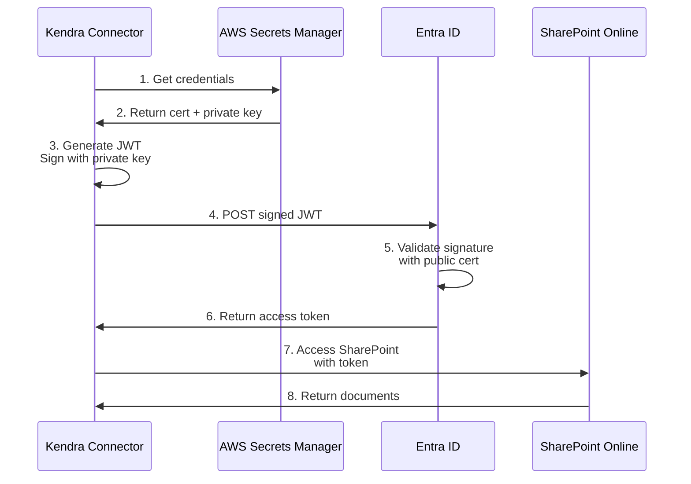
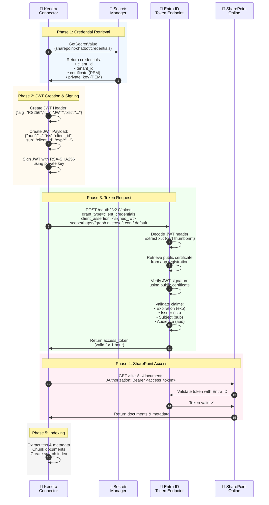
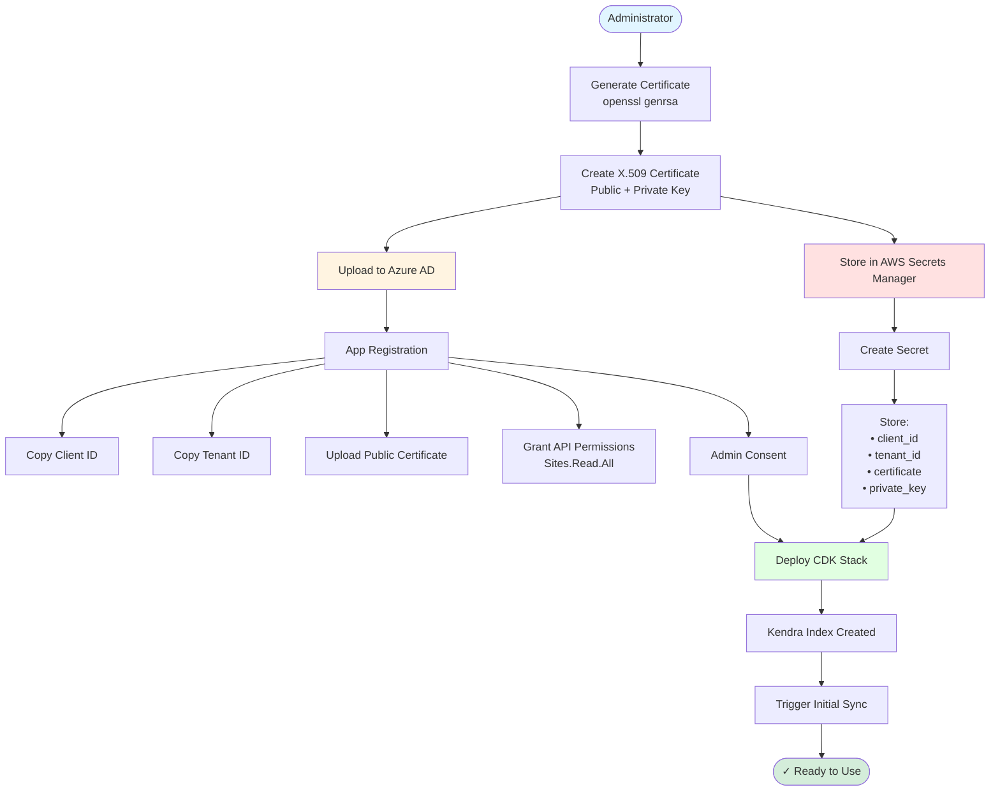
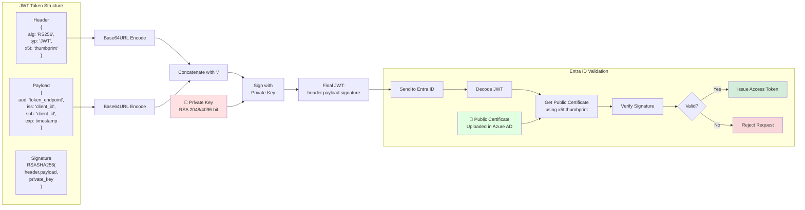
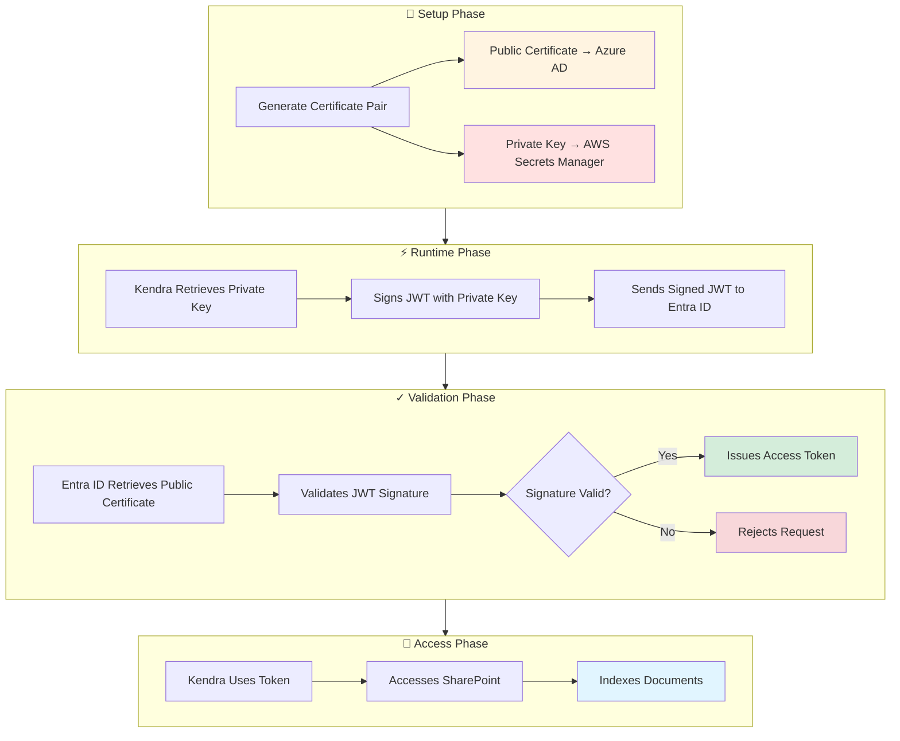
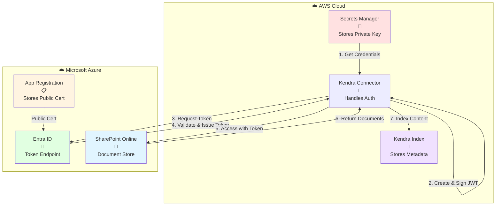
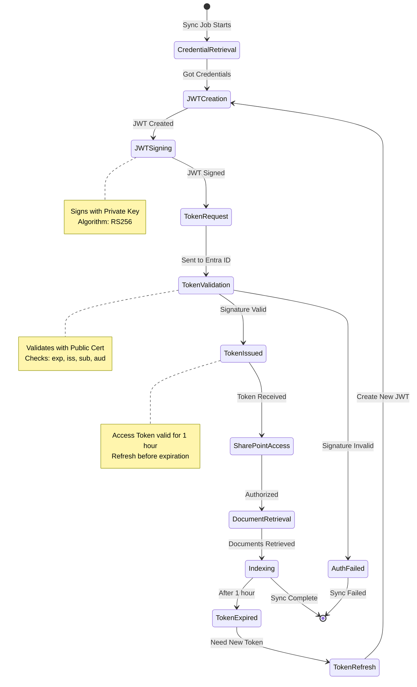
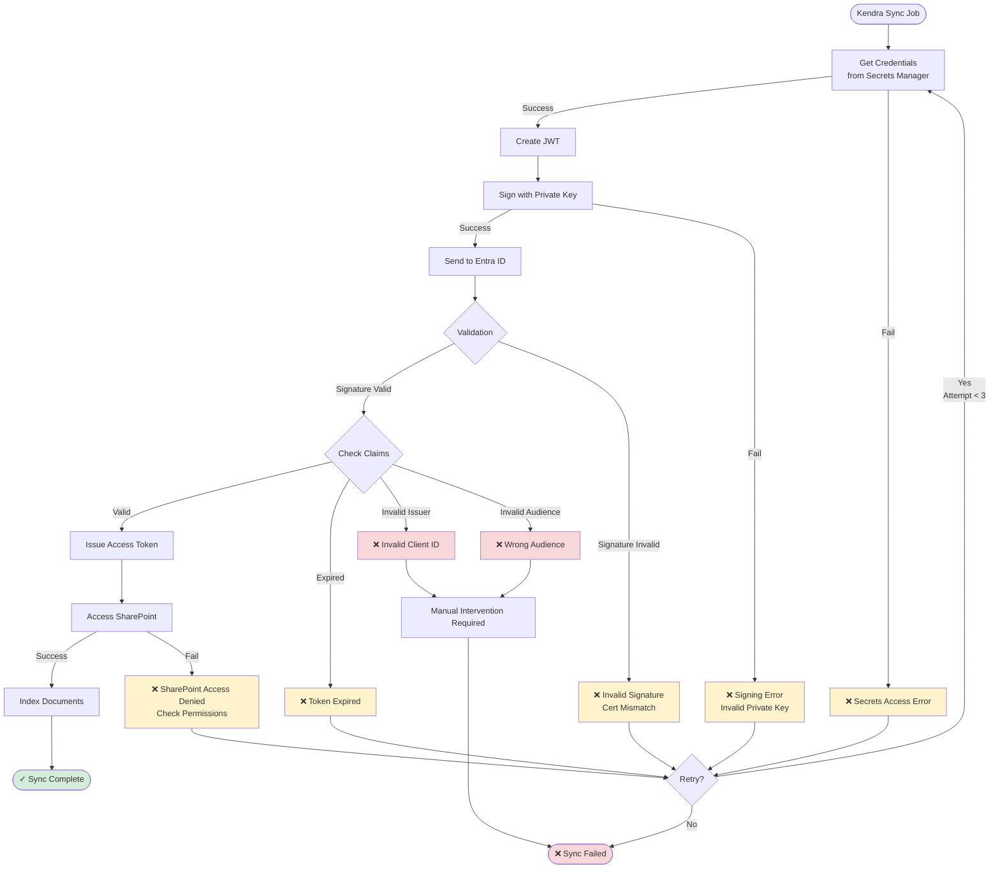

# Authentication Flow Diagrams

## Simple Authentication Flow



## Detailed Authentication Flow with Components



## Setup Flow (One-Time Configuration)



## JWT Structure and Signing



## Security Flow



## Component Interaction Overview



## Token Lifecycle



## Error Handling Flow



---

## How to View These Diagrams

### GitHub
These Mermaid diagrams render automatically on GitHub. Just view this file in your repository.

### VS Code
Install the "Markdown Preview Mermaid Support" extension.

### Online Viewers
- [Mermaid Live Editor](https://mermaid.live/)
- [GitHub Gist](https://gist.github.com/) (supports Mermaid)

### Export as Images
Use the Mermaid CLI to export as PNG/SVG:

```bash
# Install Mermaid CLI
npm install -g @mermaid-js/mermaid-cli

# Export diagram
mmdc -i authentication-flow.md -o authentication-flow.png
```

### Embed in Documentation
Most documentation tools support Mermaid:
- GitBook
- Docusaurus
- MkDocs (with plugin)
- Confluence (with plugin)
- Notion (with embed)
